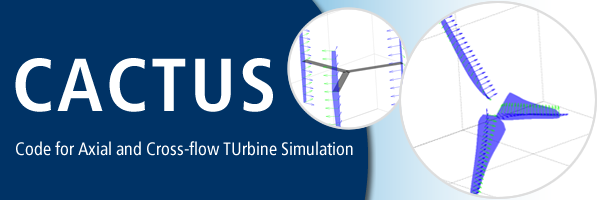

 
# CACTUS (Code for Axial and Cross-flow TUrbine Simulation)

CACTUS (**C**ode for **A**xial and **C**ross-flow **TU**rbine **S**imulations),
developed at Sandia National Laboratories, is a turbine simulation code based on a free wake vortex method. 


### Compiling

Compilation instructions for Linux, Mac, and Windows can be found in `doc/install/`.

- [Linux/Mac](doc/install/install-linux-osx.md)
- Windows
    - [Cygwin](doc/install/install-windows-cygwin.docx)
    - [Visual Studio](doc/install/install-windows-intel-compiler.docx)

#### Tests
Simple regression tests are included. After compiling, navigate to `test/RegTest/` and run:

```
PATH=$PATH:../../bin pytest runreg.py
```

### Directory Structure

- `bin`: Default target for compiled executables
- `DAKOTA`: DAKOTA drivers (by Jon Murray) and examples
- `doc`: Documentation -- user's manual, install instructions, DAKOTA drivers manual, relevant publications
- `make`: Makefiles for various compilers and platforms
- `src`: Source code
- `test`: Test cases (regression tests, example HAWT/VAWT input files, airfoil files)

### Post-processing

Tools for post-processing data from CACTUS simulations are available in the
[CACTUS-tools](https://github.com/SNL-WaterPower/CACTUS-tools) repository.


### References

For details about the development of CACTUS, please see

- Murray, J., and Barone, M., “The Development of CACTUS, a Wind and Marine Turbine Performance Simulation Code,” _49th AIAA Aerospace Sciences Meeting including the New Horizons Forum and Aerospace Exposition_, Reston, Virginia: American Institute of Aeronautics and Astronautics, 2011, pp. 1–21.

### Disclaimer

A CACTUS model V&V studies (Michelen et al. 2014, Wosnik et al. 2016) for cross-flow hydrokinetic turbines demonstrated it accurately predicts performance characteristics for axial-flow turbines, but it should not be used for cross-flow geometries.

- Michelen, C., V.S. Neary, J. Murray, and M. Barone, M. (2014). CACTUS open-source code for hydrokinetic turbine design and analysis: Model performance evaluation and public dissemination as open-source tool.  Proceedings of 2nd Marine Energy Technology Symposium 2014 (METS2014), at the 7th Annual Global Marine Renewable Energy Conference (GMREC 2014), Seattle, WA, April 15-18. 

- Wosnik M., Bachant P., Neary V.S., and A.W. Murphy (2016). Evaluation of Design & Analysis Code, CACTUS, for Predicting Cross-flow Hydrokinetic Turbine Performance.  SAND2016-9787, September 2016. 34 pages.

